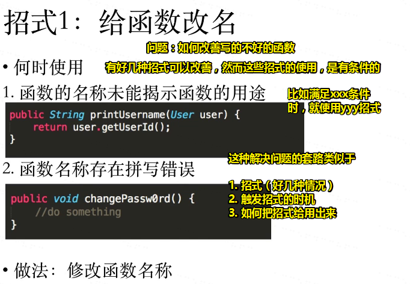
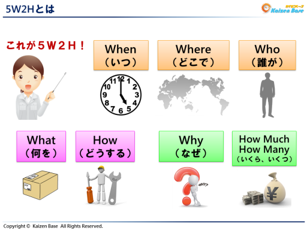
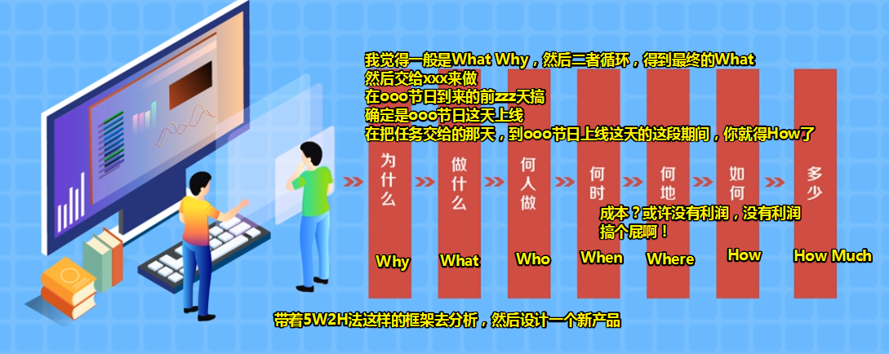

# ARTS-01-0627

## ★A

## ★R

## ★T

一种学习姿势：

通过这种姿势，引出5W2H这种目前我认为是终极的姿势（一般5W1H即可）：

那么5W2H是什么呢？

简单来说就是这样：

|          | 一般的説明                                                 | 改进案件时的标准用语        |
| -------- | ---------------------------------------------------------- | --------------------------- |
| Why      | 为什么（效果）                                             | 目的、目标（效果）          |
| Ｗhat    | 要解决什么问题、这盒子里边的东西是什么                     | 问题（如需要改进xxx的问题） |
| Where    | 设定任何对象的范围（作用域的调调）                         | 对象范围                    |
| How      | 什么样的方法、解决方案                                     | 实现手段（系统方案）        |
| When     | 花了多少时间                                               | 实现时期                    |
| Who      | 在什么体制下……人（有种啥身份的人干，听说你是体制内的人？） | 实现体制                    |
| How Much | 花多少钱……黄金（成本这么高？老子不干了）                   | 必要费用                    |

为什么会有5W2H？

> 5W2H分析法又叫七问分析法，是二战中美国陆军兵器修理部首创。简单、方便，易于理解、使用，富有启发意义，**广泛用于企业管理和技术活动**（where），**对于决策和执行性的活动措施也非常有帮助，也有助于弥补考虑问题的疏漏。**（Why）

总之，你脑袋瓜子里边装有它，那么我们「发现问题、提出疑问、解决问题」就简单很多了。

话说，这种分析法，是有顺序的吗？

没有一定的顺序呀！像我写代码的时候，我是先What（知道自己做什么），然后How（一顿copy），然后探索Why（为啥要这代码要这样写）、最后理解What（哦！以后遇到这类问题就知道怎么解决了）。

> 简单来说，我直接用了黄金圈法则去写代码。

举个有顺序的栗子来说：

发明者在设计新产品时，常常提出：

总之，当你学习一个技术（如Java语言）的时候（一般不计成本，毕竟学习使人快乐。直接5W1H），请先问自己5个问题：

1. What：这玩意是啥？（一门用于后端开发的编程语言）

2. When：何时使用它？（后端开发xxx项目）

3. Where：啥地方使用它？（通常是技术选型的时候。优劣分析的时候）

4. Who：适用对象。（需要使用Java做后端项目的人）

5. Why：为什么要用这玩意儿？（跨平台、使用人数最多、生态极好）

6. How：怎么写代码来搞事情？与此同时，在写代码的过程中，可以理解这代码为啥要这样写（Why）？借此又知道了这代码之所以要在这里写的时机（When）。

   如A：定义100个int类型的变量；B：定义了一个含有100个元素的数组。这就是为啥用数组的原因。

   至此，我们就知道了何时要用数组呢？比如面对A这种情况——大量重复的东西、需要组织起来，然后批量的操作。当然这也体现了何地（Where）

   可见，这也解决了数组是什么，如把这一样一堆的东西放到一起，好集中处理

   接下来又是How了，我怎么样开辟一个数组？怎么样根据下标去访问那个元素？如何去遍历？等等都是how的东西。

**➹：**[“5W1H”带你来学习JavaScript - LuckyZhouStar - CSDN博客](https://blog.csdn.net/luckyzhoustar/article/details/38534039)

**➹：**[5W2H分析法的学习笔记 - 海龙的天空 - CSDN博客](https://blog.csdn.net/airsoft/article/details/5847246)

**➹：**[1.5W2H手法とは(What)](http://www.newspt.co.jp/contents/manual/yes/od/2aba_1.html)

**➹：**[5W2H(5W1H)とは【改善活動の基礎講座－カイゼンの基本編：第６章】- Kaizen Base カイゼンベース](https://www.kaizen-base.com/contents/kall-42428/)

**➹：**[5W2H分析法_百度百科](https://baike.baidu.com/item/5W2H%E5%88%86%E6%9E%90%E6%B3%95/8111597)

**➹：**[六何法 - 维基百科，自由的百科全书](https://zh.wikipedia.org/wiki/%E5%85%AD%E4%BD%95%E6%B3%95)

**➹：**[如何使用5W2H分析法？ - 知乎](https://www.zhihu.com/question/264164169)

**➹：**[常用的思考方法有哪些？你会在什么情况下使用？ - 知乎](https://www.zhihu.com/question/20803763)

**➹：**[「体制内」是什么？ - 知乎](https://www.zhihu.com/question/25026763)

## ★S

